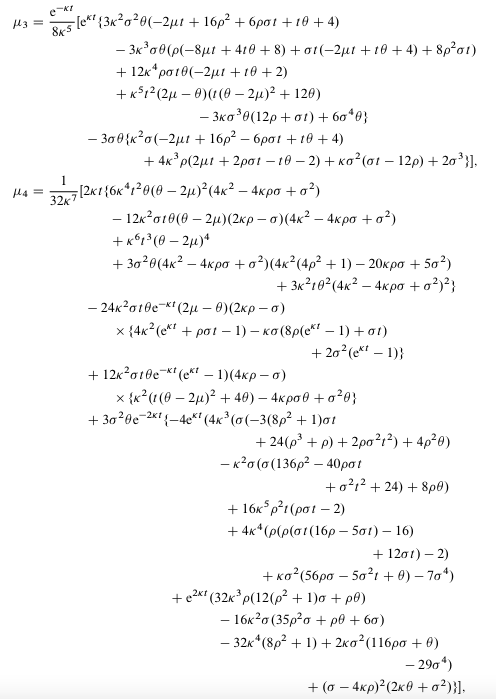
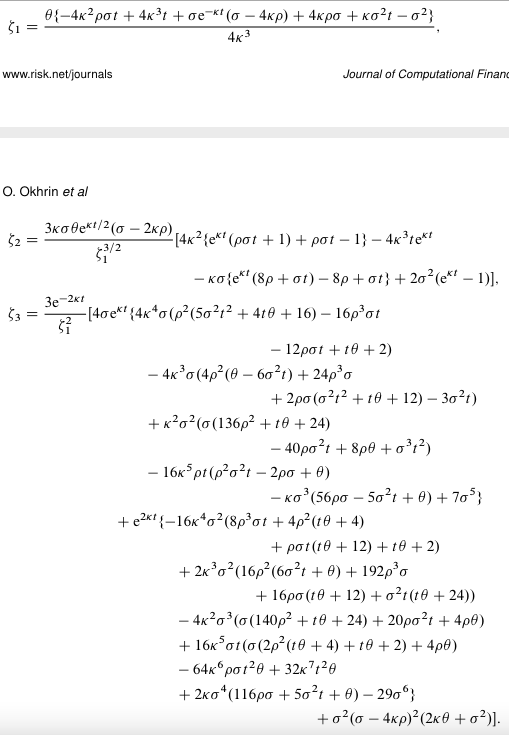
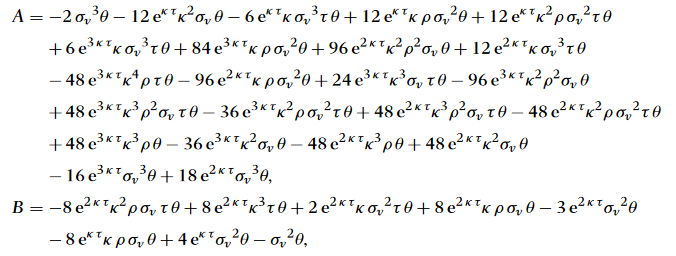
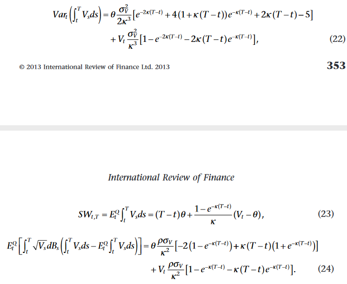
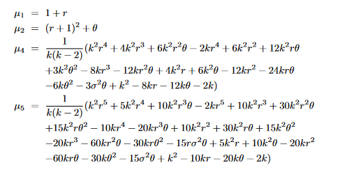
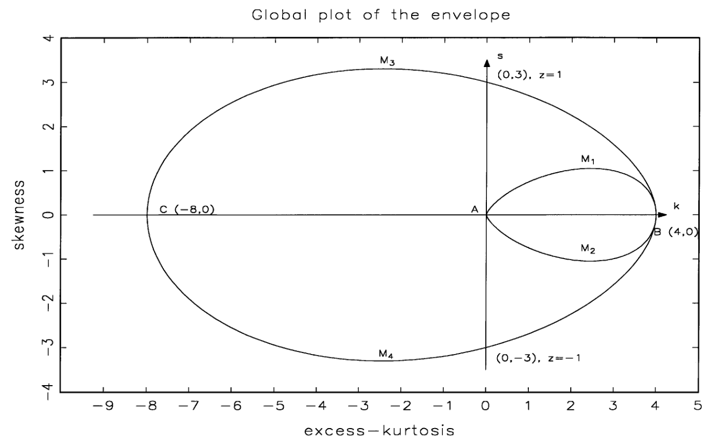
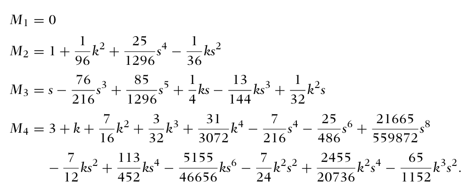
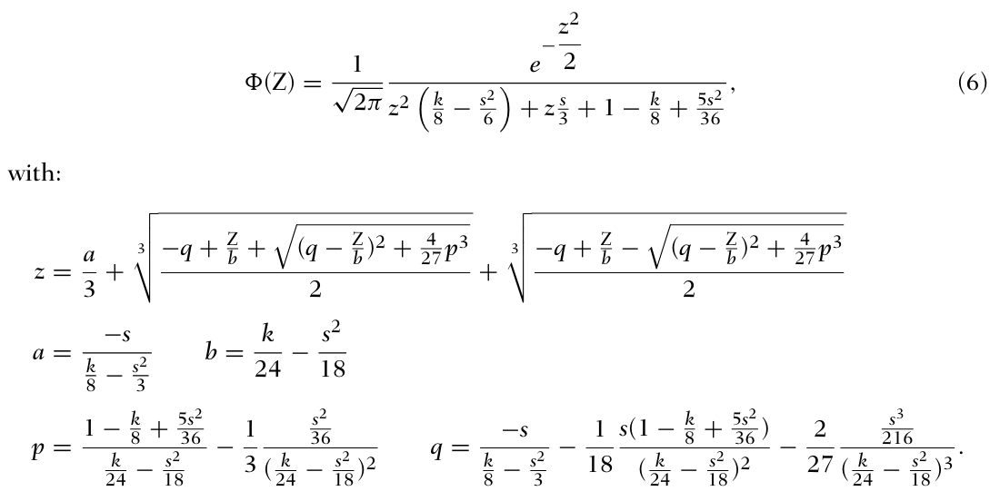

# heston-moments-pdf
Diploma thesis about the Heston SV Model, theoretical and realized moments &amp; pdf expansion methods

Heston Process ($X_t$ process from "Simulating the Cox–Ingersoll–Ross and Heston processes: matching the first four moments"):
$$\begin{align}
\mathrm{d}S_t &= \mu S_t\mathrm{d}t + \sqrt{v_t}S_t\mathrm{d}W_t^S \\
\mathrm{d}X_t = \mathrm{d}\log(S_t) &= \left(\mu-\frac{1}{2}v_t\right)\mathrm{d}t + \sqrt{v_t}\mathrm{d}W_t^S \\
\mathrm{d}v_t &= \kappa(\theta-v_t)\mathrm{d}t + \sigma\sqrt{v_t}\mathrm{d}W_t^v \\
\mathbb{E}(\mathrm{d}W_t^S\mathrm{d}W_t^v) &= \rho\mathrm{d}t
\end{align}$$
with
- $S_t$ price
- $\mu$ drift
- $v_t$ variance
- $\kappa$ speed of mean reversion
- $\theta$ long-term-variance
- $\sigma$ volatility of variance
- $W_t^S$, $W_t^v$ Wiener Processes

---

From Heston Process are already known (add citations):
- theoretical moments
- theoretical distribution
- theoretical quantiles

For log-returns $r_t=X_t-X_0$ in "Distributional properties of continuous time processes: from CIR to bates" $\to$ only for jump diffusion process!

"Simulating the Cox–Ingersoll–Ross and Heston processes: matching the first four moments": log-return $r_t = X_t-X_0$
- unconditional noncentral moments of $r_t$ are $\mu_i$'s
    - mean $\mu_1 = \left(\mu - \frac{\theta}{2}\right)t$
    - variance $\mu_2 = \frac{1}{4\kappa^3}\left(\exp(-\kappa t)\left[\exp(\kappa t)\left\lbrace\kappa^3 t(t(\theta-2\mu)^2 + 4\theta) - 4\kappa^2\rho\sigma t\theta + \kappa\rho\sigma(4\rho + \sigma t) - \sigma^2\theta\right\rbrace + \sigma\theta(\sigma-4\kappa\rho)\right]\right)$
    - $\mu_3$ and $\mu_4$ are more complicated
    
- unconditional central moments of $r_t$ are $\zeta_i$'s
    - variance $\zeta_1 = \mathbb{E}\left[(r_t-\mu_1)^2\right]$
    - skewness $\zeta_2 = \mathbb{E}\left[\left(\frac{r_t-\mu_1}{\zeta_1^{1/2}}\right)^3\right]$
    - kurtosis $\zeta_3 = \mathbb{E}\left[\left(\frac{r_t-\mu_1}{\zeta_1^{1/2}}\right)^4\right]$
    

Cumulants of $R_t^T = \ln\left(\frac{S_T}{S_t}\right)$, continousely compounded return, in "The Skewness Implied in the Heston Model and Its Application"
- unconditional skewness $=-\sigma\frac{\sqrt{2}A}{\sqrt{\kappa}B^{3/2}}$ with 

Zhao et al 2013: Variance of $R_t^T = \mathbb{E}(R_t^T-\mathbb{E}(R_t^T))^2 = \frac{1}{4}\text{Var}(\int_t ^T V_sds) + SW + \mathbb{E}(\int_t^T \sqrt{V_s}dB_s(\int_t^T V_sdx-\mathbb{E}(\int_t^T V_sds)))$ with , replace $V_t$ with $\theta$ as in (Zhang 2017) gives unconditional variance, alternatively (unconditional) variance is also included in Zhang 2017 paper

Moments of $Q_{t+1}=\frac{S_{t+1}}{S_t}$ in "Estimating Option Prices with Heston’s Stochastic Volatility Model" ($r$ drift, $k=\kappa$)
- $\mathbb{E}(Q_{t+1})=\mu_1=1+r$
- $\mathbb{E}(Q_{t+1}^2)=\mu_2=(r+1)^2+\theta$
- $\mathbb{E}(Q_{t+1}^3)=\mu_3=(r+1)^3+3\theta+3r\theta$
- $\mathbb{E}(Q_{t+1}^4)=\mu_4=\frac{1}{k(k-2)}(k^2r^4+4k^2r^3+6k^2r^2\theta+ \dots)$

Moments of $S_t$ seam hard to find: "Unfortunately, a closed-form formula for the skewness has never been presented" (Zhang et al 2017)

both papers use Mathematica to get exact formulas, and suggest using characteristic function
- Wikipedia: If a random variable $X$ has moments up to $k$-th order, then the characteristic function $\phi_X$ is $k$ times continuously differentiable on the entire real line. In this case $\mathbb{E}(X^k)=i^{-k}\phi_X^{(k)}(0)$

---

Simulation of the process with discretisation gives realised moments (Haozhen works on that) and realised quantiles

---

Realised Moments + Expansion Method $\to$ pdf/cdf $\to$ compare to theoretical distribution
- which expansion method works best?

**Gram-Charlier-Expansion Type A** ("Gram-Charlier densities", original paper: "Ueber die Entwickelung reeller Functionen in Reihen mittelst der Methode der kleinsten Quadrate.")
$$f(x) = p_n(x)\cdot \phi(x)$$
with
- $\phi(x)$ pdf of standardized normal distribution (zero mean, unit variance)
- $p_n(x) = 1 + \frac{\gamma_1}{6}He_3(x) + \frac{\gamma_2}{24}He_4(x)$
- $\gamma_1$ skewness
- $\gamma_2$ excess kurtosis
- $He_3(x) = x^3-3x$
- $He_4(x) = x^4-6x^2+3$

**Edgeworth-Expansion** ("Gram-Charlier densities", original paper: "On the Representation of Statistical Frequency by a Series")
$$f(x) = p_n(x)\cdot \phi(x)$$
with
- $\phi(x)$ pdf of standardized normal distribution (zero mean, unit variance)
- $p_n(x) = 1 + \frac{\gamma_1}{6}He_3(x) + \frac{\gamma_2}{24}He_4(x) + \frac{\gamma_1^2}{72}He_6(x)$
- $\gamma_1$ skewness
- $\gamma_2$ excess kurtosis
- $He_3(x) = x^3-3x$
- $He_4(x) = x^4-6x^2+3$
- $He_6(x) = x^6-15x^4+45x^2-15$

There might be problems with positivity of $f(x)$ with certain $\gamma_1$ and $\gamma_2$, read "Barton and Dennis (1952)"
 (image from "Gram-Charlier densities")
- only in region $AM_1BM_2A$ Gram-Charlier-Expansion is positive for every $x$
- validity of the Cornish–Fisher case is much wider than in the Gram–Charlier case ("Option Pricing Under Skewness and Kurtosis Using a Cornish–Fisher Expansion")

<!---
**Cornish-Fisher-Expansion** (original paper: Cornish & Fisher 1938): Transformation from standard normal distribution $z$ to $Z$ (Mailard 2018, Barra 2006):
$$Z \approx z + (z^2-1)\cdot\frac{s}{6} + (z^3-3z)\cdot\frac{k}{24} - (2z^3-5z)\cdot\frac{s^2}{36}$$
with
- $z\sim N(0,1)$
- $k$ determines excess kurtosis
- $s$ determines skewness

Effective skewness $s^*$ and excess kurtosis $k^*$ are calculated by $$s^* = \frac{M_3}{M_2^{1.5}} \\ k^* = \frac{M_4}{M_2^2}-3$$
where $M_i$ are the moments of the Cornish-Fisher distribution: 

$Z$ is non standard (mean of zero, variance not exactly one), so standardize it $$Z = \frac{z + (z^2-1)\cdot\frac{s}{6} + (z^3-3z)\cdot\frac{k}{24} - (2z^3-5z)\cdot\frac{s^2}{36}}{\sqrt{M_2}}$$
gives pdf of $Z$ (Aboura & Mailard 2016):

Given $s^*$ and $k^*$ we can find many solutions for $s$ and $k$. We need to filter out solutions where $k<-3$ as excess kurtosis can't be smaller than -3. We can also filter out solutions where $M_2<0$ as the variance of the Cornish-Fisher distribution can't be negative.
-->

**Saddlepoint Approximation** (original paper: "Saddlepoint Approximations in Statistics", "Saddlepoint Approximations with Applications")
$$f(x) \approx\frac{1}{\sqrt{2\pi K''(s)}}\exp(K(s)-sx)$$
with
- $K(\cdot)$ cumulant generating function
- $K''(\cdot)$ second derivative of $K(\cdot)$
- $s$ saddlepoint, solution of $K'(s)=x$

To get the cumulant generating function, we do a taylor expansion of $K$ at 0. The first four cumulants are the first four derivatives of $K$ at 0:
$$K(t) \approx \kappa_1t + \frac{\kappa_2t^2}{2} + \frac{\kappa_3t^3}{6} + \frac{\kappa_4t^4}{24}$$
with
- $\kappa_1$ mean
- $\kappa_2$ variance
- $\kappa_3$ skewness
- $\kappa_4$ excess kurtosis

---

Comparing realised moments and theoretical moments was done by Neuberger & Payne (2021)
- with short term skew + kurtosis, long term skew and kurtosis are precisely estimatable