# Expansion Method Tests
How good does the Gram-Charlier, GC with positivity constraints, Cornish-Fisher Expansion, Edgeworth Expansion and Saddlepoint Approximation work for known distributions with known skewness and kurtosis?

Three distributions:
- standard normal
    - skewness 0
    - excess kurtosis 0
- lognormal, parameter: $\sigma^2$
    - skewness $(\exp(\sigma^2)+2)\cdot \sqrt{\exp(\sigma^2)-1}$
    - excess kurtosis $1\cdot\exp(4\sigma^2)+2\exp(3\sigma^2)+3\exp(2\sigma^2)-6$
- student's t, parameter: $\nu$
    - skewness 0 for $\nu>3$
    - excess kurtosis $\frac{6}{\nu-4}$ for $\nu>4$
- non-central t, paramter: $\nu, \mu$
    - skewness $\frac{\mu\sqrt{\nu}\Gamma\left(\frac{\nu-1}{2}\right)\left(\frac{\nu(\mu^2+2\nu-3)}{(\nu-3)(\nu-2)}-2\left(\frac{(\mu^2+1)\nu}{\nu-2} - \frac{\mu^2\nu\Gamma\left(\frac{\nu-1}{2}\right)^2}{2\Gamma\left(\frac{\nu}{2}\right)^2}\right)\right)}{\sqrt{2}\Gamma\left(\frac{\nu}{2}\right)\left(\frac{(\mu^2+1)\nu}{\nu-2} -\frac{\mu^2\nu\Gamma\left(\frac{\nu-1}{2}\right)^2}{2\Gamma\left(\frac{\nu}{2}\right)^2}\right)^{3/2}}$ for $\nu>3$
    - excess kurtosis $\frac{\frac{(\mu^4+6\mu^2+3)\nu^2}{(\nu-4)(\nu-2)} - \frac{\mu^2\nu}{2\Gamma\left(\frac{\nu}{2}\right)^2}\Gamma\left(\frac{\nu-1}{2}\right)^2\left(\frac{\nu(\mu^2(\nu+1)+3(3\nu-5))}{(\nu-3)(\nu-2)} - 3\left(\frac{(\mu^2+1)\nu}{\nu-2} - \frac{\mu^2\nu\Gamma\left(\frac{\nu-1}{2}\right)^2}{2\Gamma\left(\frac{\nu}{2}\right)^2}\right)\right)}{\left(\frac{(\mu^2+1)\nu}{\nu-2} - \frac{\mu^2\nu\Gamma\left(\frac{\nu-1}{2}\right)^2}{2\Gamma\left(\frac{\nu}{2}\right)^2}\right)^2}-3$ for $\nu>4$

Set parameters to $\sigma=0.5$, $\nu=5$ and $\mu=0.5$, yields (skewness, excess kurtosis):
- normal distribution 0 0
- lognormal: 1.7501896550697178 5.898445673784778
- t: 0 6
- nct: 0.6751189806173602 7.218914650141592

## Gram-Charlier Expansion


- fit is not good
- gram-charlie expansion gets negative, not a density

Why is the difference at $x=0$ so big?
- pdf of t distribution mit $\nu$ degress of freedom: $f(x) = \frac{\Gamma\left(\frac{\nu+1}{2}\right)}{\sqrt{\nu\pi}\Gamma\left(\frac{\nu}{2}\right)}\left(1+\frac{x^2}{\nu}\right)^{-\frac{\nu+1}{2}}$
- with $x=0$ and $\nu=5$ we get $f(0)=0.3796$
- t distribution with this parameters has the following moments:
    - mean: 0
    - variance: 5/3
    - skewness: 0
    - excess kurtosis: 6
- GC expansion with $z=\frac{x-\mu}{\sigma}$ and $f(z) = \phi(z)\left[1+\frac{s}{6}He_3(z) + \frac{k}{24}He_4(z)\right]$
- $z = \sqrt{\frac{3}{5}}x = 0$ and $He_4(z)=z^4-6z^2+3$ gives $f(0)=0.3989\left[1+\frac{6}{24}\cdot 3\right] = 0.3989\cdot 1.75 = 0.6981$
- if we increase $x$ by a small amount, $z$ will be increased less (since $\sqrt{\frac{3}{5}}=0.7746$), higher powers of $z$ (like $z^4$, $z^3$) will be smaller than lower powers of $z$ (like $z^2$, $z$) and lower powers of $z$ have negative coefficients in Hermite-Polynomials ($He_3(z) = z^3-3z$, $He_4(z)=z^4-6z^2+3$) which will counteract the $+3$ in $He_4$ and $+1$ in factor after $\phi(z)$, especially for high kurtosis.
- adding more terms to the expansion will not help, 5th moment will be 0 for any t distribution with more than 5 degrees of freedom, for 5 df, the 5th and higher moments are not defined

## Gram-Charlier Expansion with Positivity Constraints

Transforms theoretical skewness and kurtosis to
- lognormal: 0.10234746774707859 3.989055204819389
- t: 0.0 3.9901095073734614
- nct: 0.024892965655198204 3.9970717567756724

<!-- 
- fit is not good, but better
- alt least no negativity -->


### How to find this boundary?
- Solve $1 + \frac{s}{6}He_3(z) + \frac{k}{24}He_4(z)=0$ for $s$ and $k$
$$\begin{align}
1 + \frac{s}{6}He_3(z) + \frac{k}{24}He_4(z)&=0 \\
\frac{s}{6}He_3(z) &= -1 - \frac{k}{24}He_4(z) \\
s\cdot He_3(z) &= -6 - \frac{k}{4}He_4(z) \\
s &= -\frac{6}{He_3(z)} - \frac{He_4(z)}{4\cdot He_3(z)}k \\
s &= \frac{z^4-6z^2+3}{12z-4z^3}\cdot k + \frac{24}{12z-4z^3}
\end{align}$$
This works as long as $z\neq\pm\sqrt{3}$

(actually we don't need the following)
$$\begin{align}
1 + \frac{s}{6}He_3(z) + \frac{k}{24}He_4(z)&=0 \\
\frac{k}{24}He_4(z) &= -1 - \frac{s}{6}He_3(z) \\
k\cdot He_4(z) &= -24 - 4s\cdot He_3(z) \\
k &= -\frac{24}{He_4(z)} - \frac{4\cdot He_3(z)}{He_4(z)}s \\
k &= \frac{12z-4z^3}{z^4-6z^2+3}s -\frac{24}{z^4-6z^2+3}
\end{align}$$
- These lines have the form $s = a(z)\cdot k + b(z)$. For two $z$, $z_1$ and $z_2$, we get two lines $s = a(z_1)\cdot k + b(z_1)$ and $s = a(z_2)\cdot k + b(z_2)$. The intersection of this lines is one point of the boundary. 
- Two lines $f(x) = a+bx$ and $g(x) = cx+d$ intersect at $x = \frac{d-b}{a-c}$ and $y = \frac{ad-bc}{a-c}$
- Iterating from $z_1=-10$ to $z_{1000}=-\sqrt{3}$ for 1000 steps (stepsize $\Delta z$), calculating $a(z_i)$, $b(z_i)$, $a(z_i+\Delta z)$ and $b(z_i+\Delta z)$, find intersection gives a point $(k_i,s_i)$ of the boundary
- for completeness adding to more points $(4,0)$ and $(0,0)$

### Finding the analytic boundary (Try 1)
- We notice that for every $z$ the line defined by the parametric equation $1 + \frac{s}{6}He_3(z) + \frac{k}{24}He_4(z)=0$ is a tangent to the positivity boundary 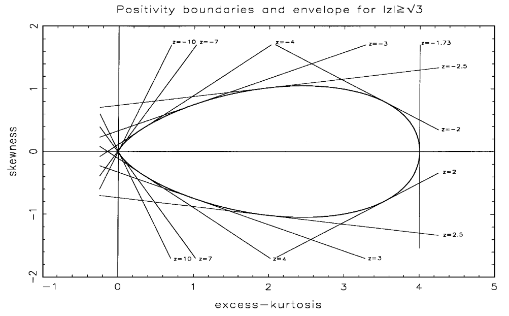
- So the boundary is the envelope of these lines
- [Wikipedia](https://en.wikipedia.org/wiki/Envelope_(mathematics)) describes a method on how to find the envelope of a family of curves:
    - Start with parametric equaion $F(k, s, z)=0$: $$F(k, s, z) = 1 + \frac{s}{6}(z^3-3z) + \frac{k}{24}(z^4-6z^2+3) = 0$$
    - Calculate derivative $\frac{\partial F}{\partial z}$ and set it to zero: $$\frac{\partial F}{\partial z} = \frac{1}{6}(kz(z^2-3) + 3s(z^2-1))\overset{!}{=}0$$
    - Solve for $z$ (2 complex solutions, 1 real solution): 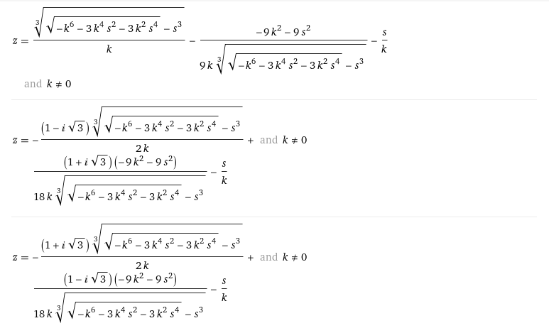
    - Plug $z$ back into $F(k, s, z)=0$ to get envelope. Done with Sympy (`symbolic_computation/gcd_simplify_z.py`):
    ```
    k*((-s/k - (-9*k**2 - 9*s**2)/(9*k*(-s**3 + sqrt(-k**6 - 3*k**4*s**2 - 3*k**2*s**4))**0.333333333333333) + (-s**3 + sqrt(-k**6 - 3*k**4*s**2 - 3*k**2*s**4))**0.333333333333333/k)**4 - 6*(-s/k - (-9*k**2 - 9*s**2)/(9*k*(-s**3 + sqrt(-k**6 - 3*k**4*s**2 - 3*k**2*s**4))**0.333333333333333) + (-s**3 + sqrt(-k**6 - 3*k**4*s**2 - 3*k**2*s**4))**0.333333333333333/k)**2 + 3)/24 + s*((-s/k - (-9*k**2 - 9*s**2)/(9*k*(-s**3 + sqrt(-k**6 - 3*k**4*s**2 - 3*k**2*s**4))**0.333333333333333) + (-s**3 + sqrt(-k**6 - 3*k**4*s**2 - 3*k**2*s**4))**0.333333333333333/k)**3 + 3*s/k + (-9*k**2 - 9*s**2)/(3*k*(-s**3 + sqrt(-k**6 - 3*k**4*s**2 - 3*k**2*s**4))**0.333333333333333) - 3*(-s**3 + sqrt(-k**6 - 3*k**4*s**2 - 3*k**2*s**4))**0.333333333333333/k)/6 + 1
    ```
    - Bring it to the form $s = f(k)$ with Sympy (`symbolic_computation/gcd_solve_for_s.py`): The computation fails because multiple generators are not implemented in Sympy which indicates a equation with no closed-form solution

### Finding the analytic boundary (Try 2)
- The boundary consists out of points which are intersections from two lines $1 + \frac{s}{6}(z^3-3z) + \frac{k}{24}(z^4-6z^2+3) = 0$ for two different $z$. We found the equations for this lines in the previous section: $s = a(z)\cdot k + b(z)$ with 
$$\begin{align}a(z) &= \frac{z^4-6z^2+3}{12z-4z^3} \\
b(z) &= \frac{24}{12z-4z^3}\end{align}$$
- For two neighboring $z$ and $z+\Delta z$ the intersection $(k,s)$ is
$$\begin{align}
a(z)\cdot k + b(z) &= a(z+\Delta z)\cdot k + b(z+\Delta z) \\
a(z)\cdot k - a(z+\Delta z)\cdot k &= b(z+\Delta z) - b(z) \\
k &= \frac{b(z+\Delta z) - b(z)}{a(z) - a(z+\Delta z)} \\
\end{align}$$
- Let $\Delta z\to 0$ and we get
$$\begin{align}
k &= \frac{\frac{\mathrm{d}b}{\mathrm{d}z}}{\frac{\mathrm{d}a}{\mathrm{d}z}} \\
\frac{\mathrm{d}b}{\mathrm{d}z} &= \frac{18(z^2-1)}{z^2(z^2-3)^2} \\
\frac{\mathrm{d}a}{\mathrm{d}z} &= -\frac{z^6-3z^4+9z^2+9}{4z^2(z^2-3)^2} \\
k &= \frac{72-72z^2}{z^6-3z^4+9z^2+9}
\end{align}$$
- If we want to plug this in into $s = a(z)\cdot k + b(z)$, we need to bring $k(z)$ in the form $z(k)$ (Sympy, `symbolic_computation/gcd_solve_for_zk.py`)
 ```
can't solve in 24 hours
```

### Doing MLE numerically as Michael/Haozhe suggested
- Maximum-Likelihood-Estimation: $\max F(s, k, ...)$ where $(s,k)$ are in positivity region $\mathcal{D}$ (constraint optimization)
- unconstraint optimisation: $\max F(s, k, ...)$ where $(\tilde{s},\tilde{k})$ are in $\mathbb{R}^2$, but we have a transformation
  ```python
  s, k = transform_skew_kurt_into_positivity_region(s, k, boundary)
  ```
  where `transform_skew_kurt_into_positivity_region` takes points of the `boundary` and applies the logistic map suggested in Michaels paper.
  ```python
  def neg_log_likelihood(params, data):
      mu, variance, s, k = params
      s, k = transform_skew_kurt_into_positivity_region(s, k, intersections)
      likelihoods = gram_charlier_expansion(data, mu, variance, s, k)
      return -np.sum(np.log(likelihoods))
  ```
  is the function we want to minimze with `scipy.optimize.minimize` and let it find mean, variance, skewness and excess kurtosis for some `data` (data is generated from normal, lognormal, t or nct distribution). The optimizer is L-BFGS-B. The boundary conditions are:
    - $\min(data)-1 \le \mu\le \max(data)+1$
    - $0.1 \le \sigma^2 \le 10$
    - $-10 \le s \le 10$
    - $-10 \le k \le 10$
- The inital guess are the theoretical mean, variance, skewness and excess-kurtosis of the distribution from where the `data` was sampled.
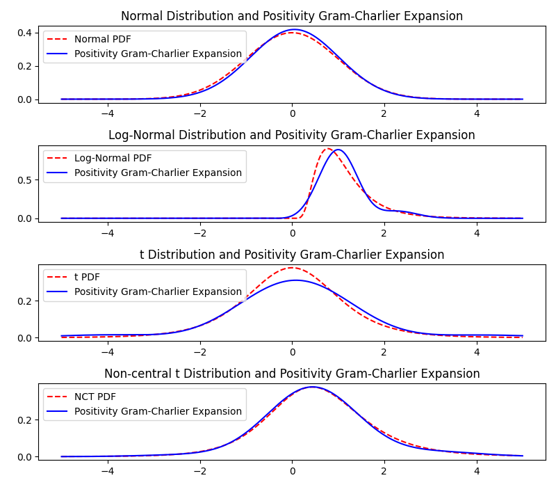
- Fitted constraint parameters:

| Distribution | $\mu$ | $\sigma^2$ | $s$ | $k$ | Log-Likelihood (fitted) | Log-Likelihood (theoretical) |
|--------------|-------|------------|-----|-----|--------------------------|-------------------------------|
| Normal       | 0.0541 | 0.9089      | 0.0001 | 0.0002 | -1424.2286 | -1417.6717 |
| Lognormal    | 1.1228 | 0.3089      | 0.9246 | 1.5193 | -871.9635 | -987.9103 |
| t            | 0.0729 | 2.7953      | -0.0361 | 2.4557 | -1713.7889 | -1878.5055 |
| nct          | 0.5461 | 1.5507      | 0.3015 | 1.3551 | -1650.4428 | -1804.9255 |

- Surprisingly good fit for all distributions, Log-Likelihood is for fitted values better than for theoretical values (theoretical values are not always inside the boundary and need to undergo a huge transformation, e.g. t distribution has theoretical excess kurtosis of 6, this gets transformed into 3.99), only for normal distribution the theoretical values are better than the fitted values, here the theoretical values are already inside the boundary
- Did a test, if any optimizer is bad, but all optimizers give roughly the same results, initial guess was here $\mu=1$, $\sigma^2=1$, $s=1$, $k=1$ for the standard normal distribution without boundarys. Every optimizer from `scipy.optimize.minimize` was used which didn't require a Jacobian.
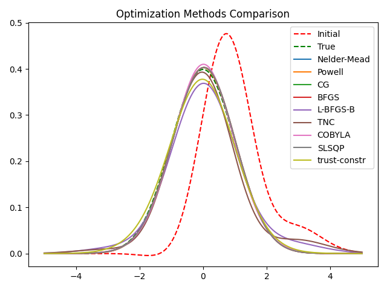

### Convergence of MLE method
- 10 samples from distribution 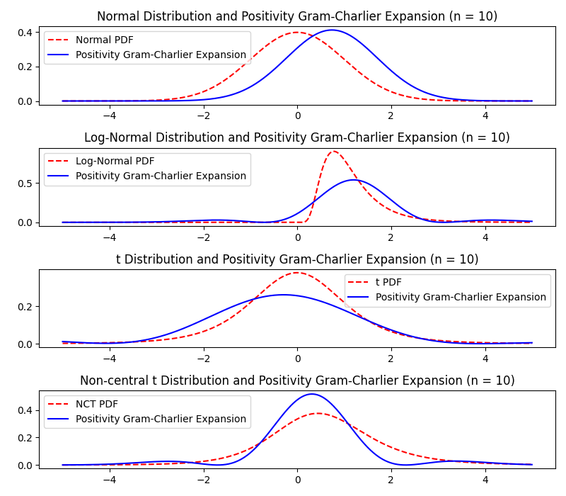
- 100 samples from distribution 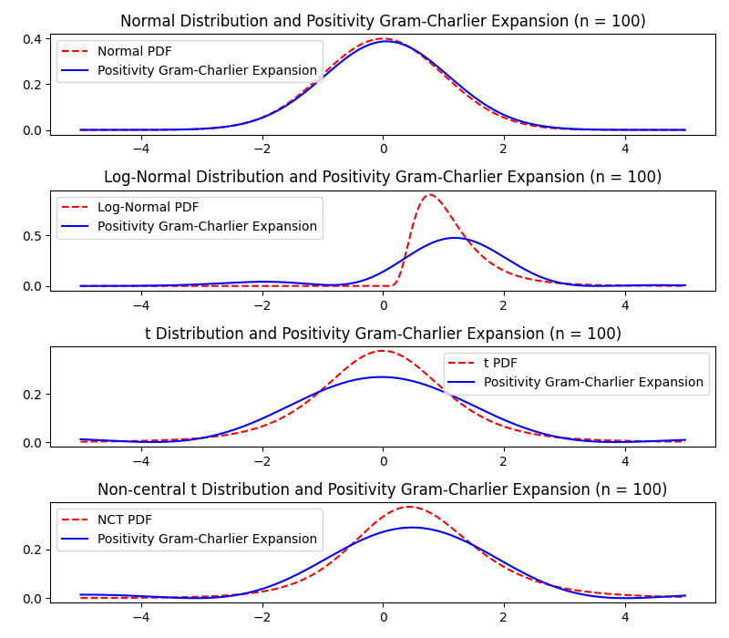
- 1000 samples from distribution 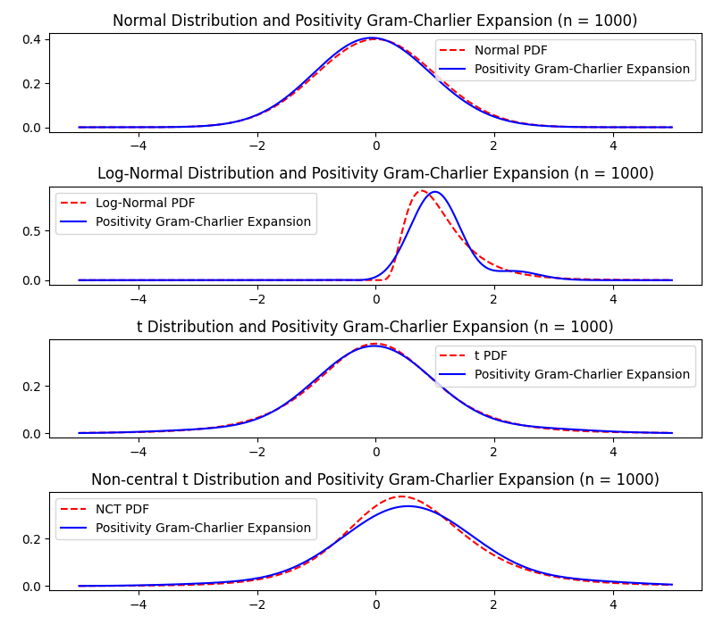
- 1000000 samples from distribution 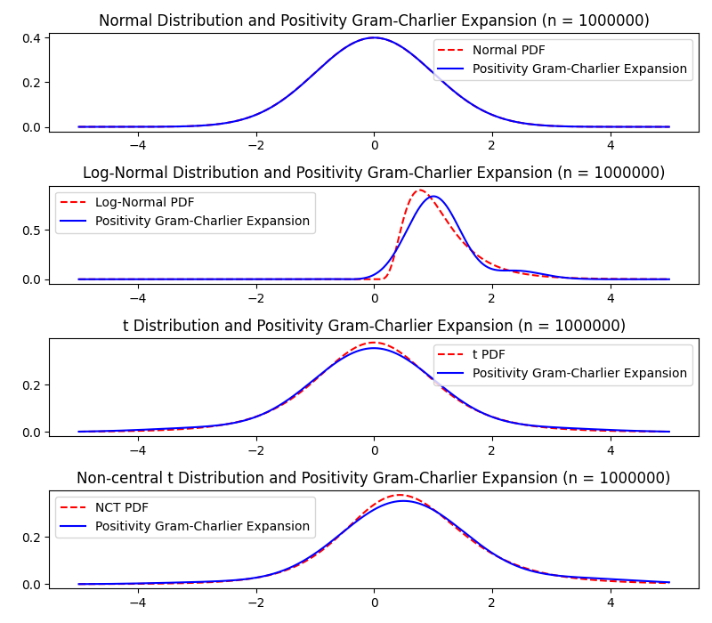
- I would say, there is not really a convergence, or if, then it is really slow

<!---
## Cornish-Fisher Expansion


- fit is not good
- for lognormal, main mass of pdf is on wrong side
-->


## Edgeworth Expansion


- fit is not good
- fit seems to be pretty similar to GC expansion, but worse for  log-normal distribution
- gets negative, not a density

### Finding the positivity boundary for Edgeworth expansion
- similar procedure as for GC expansion
- Solve $1 + \frac{s}{6}He_3(z) + \frac{k}{24}He_4(z) + \frac{s^2}{72}He_6(z)=0$ for $s$:
$$\begin{align}
0&= 1+\frac{s}{6}He_3(z) + \frac{k}{24}He_4(z) + \frac{s^2}{72}He_6(z) \\
0 &= \frac{72}{He_6(z)} + 12s\frac{He_3(z)}{He_6(z)} + 3k\frac{He_4(z)}{He_6(z)} + s^2 \\
-\frac{72}{He_6(z)} - 3k\frac{He_4(z)}{He_6(z)} &=  12s\frac{He_3(z)}{He_6(z)} + s^2 \\
-\frac{72}{He_6(z)} - 3k\frac{He_4(z)}{He_6(z)} + 36\frac{He_3(z)^2}{He_6(z)^2} &=  12s\frac{He_3(z)}{He_6(z)} + s^2 + 36\frac{He_3(z)^2}{He_6(z)^2} \\
-\frac{72}{He_6(z)} - 3k\frac{He_4(z)}{He_6(z)} + 36\frac{He_3(z)^2}{He_6(z)^2} &= \left(s+6\frac{He_3(z)}{He_6(z)}\right)^2 \\
s &= \pm\sqrt{-\frac{72}{He_6(z)} - 3k\frac{He_4(z)}{He_6(z)} + 36\frac{He_3(z)^2}{He_6(z)^2}} - 6\frac{He_3(z)}{He_6(z)}
\end{align}$$
- This holds as longs as $He_6(z)\neq 0$ which has 6 solutions:
$$\begin{align}
z_{1/2} &= \pm \sqrt{5-\frac{5^{2/3}\left(1+i\sqrt{3}\right)}{\sqrt[3]{2\left(2+i\sqrt{6}\right)}} - \frac{\left(1-i\sqrt{3}\right)\sqrt[3]{5\left(2+i\sqrt{6}\right)}}{2^{2/3}}} = \pm 0.6167\\
z_{3/4} &= \pm \sqrt{5-\frac{5^{2/3}\left(1-i\sqrt{3}\right)}{\sqrt[3]{2\left(2+i\sqrt{6}\right)}} - \frac{\left(1+i\sqrt{3}\right)\sqrt[3]{5\left(2+i\sqrt{6}\right)}}{2^{2/3}}} = \pm 1.8892 \\
z_{5/6} &= \pm \sqrt{5+\frac{10^{2/3}}{\sqrt[3]{2+i\sqrt{6}}} + \sqrt[3]{10\left(2+i\sqrt{6}\right)}} = \pm 3.3243 \\
\end{align}$$
- Plot the lines $s(k,z)$ for many values of $z$ and skipping over the 6 singularities, we get 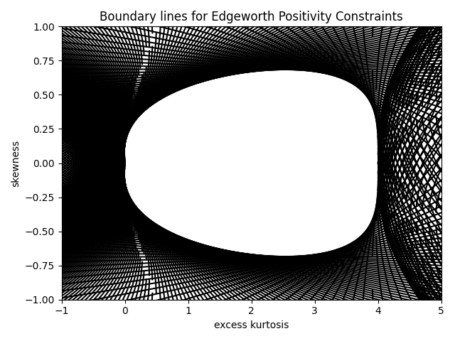, much smaller than the GC boundary, for skewness = 3 excess kurtosis can be between 0 and 4. This is the same as for GC boundary because when skewness is 0, GC and Edgeworth expansion are the same
- For $z$ in different ranges determined by the singularities, the boundary is as follows: 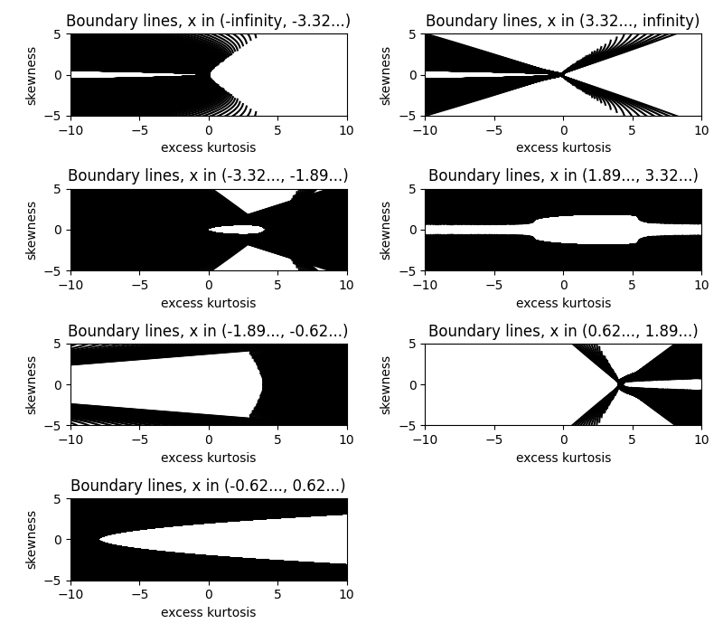, there is no range of $z$ where the boundary is smaller than for any other range
- As for GC expansion, the boundary is the envelope of the lines $s(k,z)$, we get it by calculating the intersection of the two parabolas $s(k, z)$ and $s(k, z+\Delta z)$. This is done with Sympy (`symbolic_computation/ewcd_parabolic_form.py`):
```
this yields a solution which can be found in the file
```
- The lines $s(k, z)$ are parabolas and have the form $s = \sqrt{a(z) + b(z)\cdot k} + c(z)$. For two different $z$, the parabolas $s_1 = \sqrt{a+bk}+c$ and $s_2=\sqrt{d+ek}+f$ have the two intersections (`symbolic_computation/ewcd_intersection_parabolas.py`):
```
Intersection 1:
  k = (2*(b - e)**2*(-c + f)*sqrt(-a*b*e + a*e**2 + b**2*d + b*c**2*e - 2*b*c*e*f - b*d*e + b*e*f**2) + (b**2 - 2*b*e + e**2)*(-a*b + a*e + b*c**2 - 2*b*c*f + b*d + b*f**2 + c**2*e - 2*c*e*f - d*e + e*f**2))/((b - e)**2*(b**2 - 2*b*e + e**2))
  y = c + sqrt(a + b*(2*(b - e)**2*(-c + f)*sqrt(-a*b*e + a*e**2 + b**2*d + b*c**2*e - 2*b*c*e*f - b*d*e + b*e*f**2) + (b**2 - 2*b*e + e**2)*(-a*b + a*e + b*c**2 - 2*b*c*f + b*d + b*f**2 + c**2*e - 2*c*e*f - d*e + e*f**2))/((b - e)**2*(b**2 - 2*b*e + e**2)))
Intersection 2:
  k = (2*(b - e)**2*(c - f)*sqrt(-a*b*e + a*e**2 + b**2*d + b*c**2*e - 2*b*c*e*f - b*d*e + b*e*f**2) + (b**2 - 2*b*e + e**2)*(-a*b + a*e + b*c**2 - 2*b*c*f + b*d + b*f**2 + c**2*e - 2*c*e*f - d*e + e*f**2))/((b - e)**2*(b**2 - 2*b*e + e**2))
  y = c + sqrt(a + b*(2*(b - e)**2*(c - f)*sqrt(-a*b*e + a*e**2 + b**2*d + b*c**2*e - 2*b*c*e*f - b*d*e + b*e*f**2) + (b**2 - 2*b*e + e**2)*(-a*b + a*e + b*c**2 - 2*b*c*f + b*d + b*f**2 + c**2*e - 2*c*e*f - d*e + e*f**2))/((b - e)**2*(b**2 - 2*b*e + e**2)))
```
Intersection 1:
$$
\begin{align}
k &= \frac{2(b - e)^2(-c + f)\sqrt{-ab e + ae^2 + b^2 d + b c^2 e - 2 b c ef - bd e + b e f^2} + (b^2 - 2be + e^2)(-ab + ae + bc^2 - 2bcf + bd + bf^2 + c^2e - 2cef - de + ef^2)}{(b - e)^2(b^2 - 2be + e^2)} \\
y &= c + \sqrt{a + b \cdot \left(\frac{2(b - e)^2(-c + f)\sqrt{-ab e + ae^2 + b^2 d + b c^2 e - 2 b c ef - bd e + b e f^2} + (b^2 - 2be + e^2)(-ab + ae + bc^2 - 2bcf + bd + bf^2 + c^2e - 2cef - de + ef^2)}{(b - e)^2(b^2 - 2be + e^2)}\right)}
\end{align}
$$
Intersection 2:
$$
\begin{align}
k &= \frac{2(b - e)^2(c - f)\sqrt{-ab e + ae^2 + b^2 d + b c^2 e - 2 b c ef - bd e + b e f^2} + (b^2 - 2be + e^2)(-ab + ae + bc^2 - 2bcf + bd + bf^2 + c^2e - 2cef - de + ef^2)}{(b - e)^2(b^2 - 2be + e^2)} \\
y &= c + \sqrt{a + b \cdot \left(\frac{2(b - e)^2(c - f)\sqrt{-ab e + ae^2 + b^2 d + b c^2 e - 2 b c ef - bd e + b e f^2} + (b^2 - 2be + e^2)(-ab + ae + bc^2 - 2bcf + bd + bf^2 + c^2e - 2cef - de + ef^2)}{(b - e)^2(b^2 - 2be + e^2)}\right)}
\end{align}
$$
- Plot of intersections (red dot is intersection 1, blue is intersection 2): 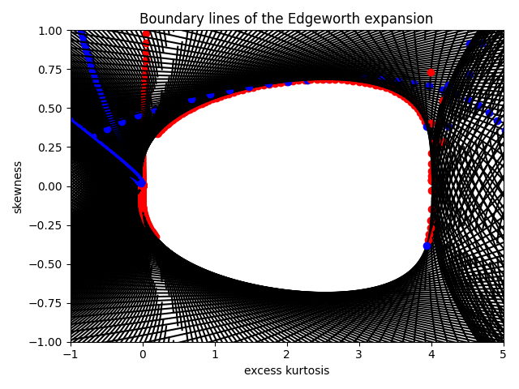, boundary gets described mostly by red dots, so ignore second intersection. The envelope is symmetric around the $x$-axis and since we have for the boundary lines a second solution of the form $s=-\sqrt{a(z)+b(z)\cdot k}+c(z)$ which have the same intersection $k$ and $-s$, we can take the absolute of $s$ for the red intersections and later mirror it around the $x$-axis. 
- If we zoom out, we see many more intersection points which are not part of the boundary (notice the axis!) 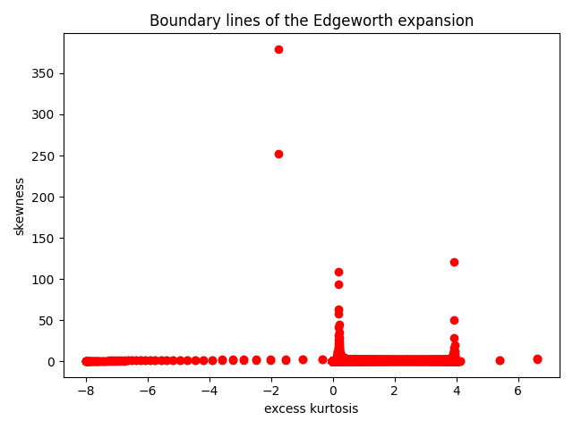
- We know from the previous images that $x$ is somewhat between 0 and 4 and $y$ between -1 and 1, so we restrict the intersection points to have $x\in (-0.1,4.1)$ and $\vert y\vert \in [0,1)$ 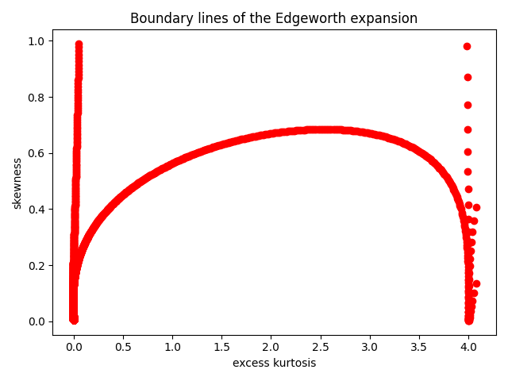
- The amount of points around $x=0$ and going up too $y=1$ are from intersections from boundary lines where $z$ is smaller than the negative third singularity, so leaving this out 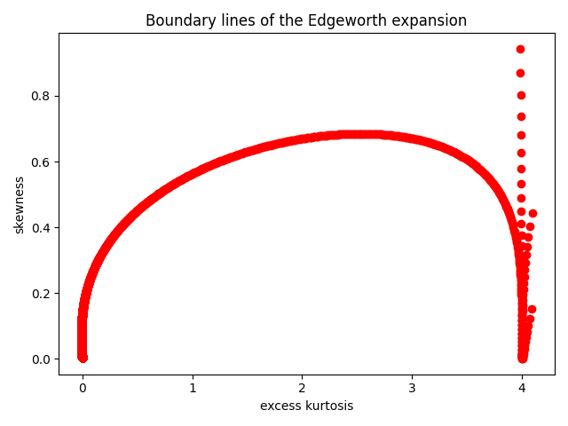
- The points around $x=4$ are hard to filter out, they come from $\vert z\vert$ around 1.8 and 1.67 and I filtered them out by removing all $z$ where $z\in (1.8-0.035, 1.8+0.035)$ or $z\in (1.67-0.015,1.67+0.015)$ 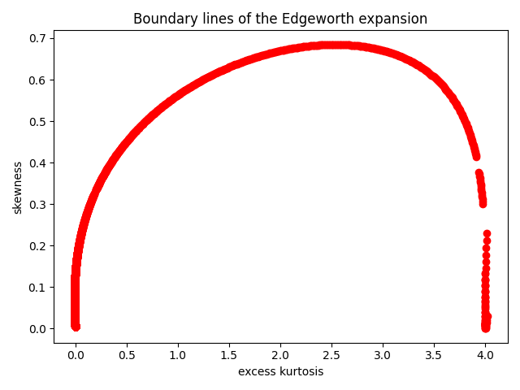
- I don't know what is happening there, I noticed that the boundary lines are extremly steep at this points, almost vertical and I get rounding errors, even when I use Python's float datatype which maps to IEEE-754 double precision with 64 bits where 52 bits are used for the fraction which equals about 16 decimal digits (Source: Python Docs and Stackoverflow answer).
- In general I am worried about computational accuracy since some points are at $x>4$, ie. one point is at $(4.01, 0.222)$, but if I try to solve the following equation 
$$
1 + \frac{0.222}{6}He_3(z) + \frac{4.01}{24}He_4(z) + \frac{0.222^2}{72}He_6(z)<0
$$
I find a solution: $-1.84611<z<-1.75826$. So my boundary points suggest that there should be no solution, the Edgeworth expansion gives a density, this is not the case. So to be on the safe side, I remove every intersection point that has not $x\in [0,4]$. 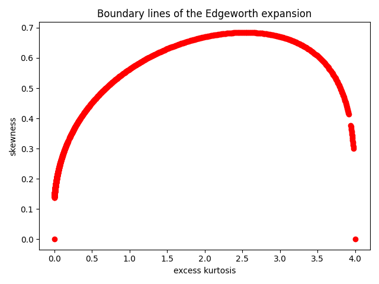
- I added (0,0) and (4,0) to the boundary points, the next and second last bondary points are (3.7795e-06, 0.1378) and (3.9775, 0.3009). A linear interpolation between these points gives the boundary.

### MLE for Edgeworth expansion
- Doing the same as for GC expansion, but with Edgeworth expansion
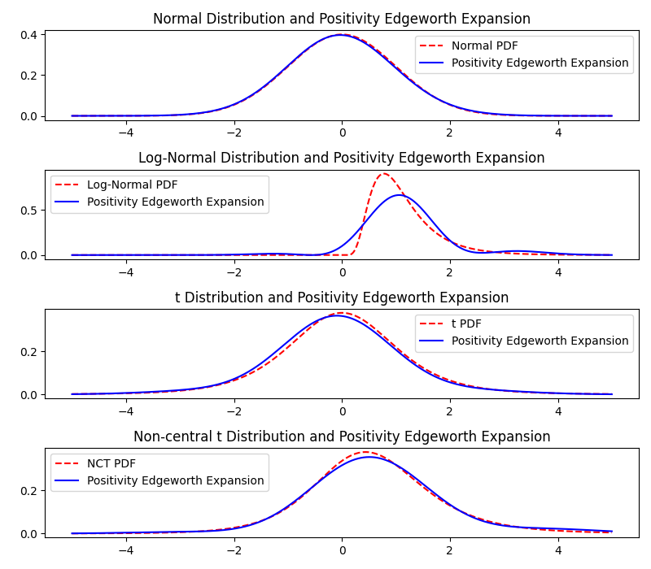
- Optimization failed with most optimizers, only Powell gave these results

## Saddlepoint Approximation

Approximation of cumulant generating function $K$:
$$K(t) \approx \kappa_1t + \frac{\kappa_2t^2}{2} + \frac{\kappa_3t^3}{6} + \frac{\kappa_4t^4}{24}$$
Derivatives:
$$\begin{align}
K'(t) &= \kappa_1 + \kappa_2t + \frac{\kappa_3t^2}{2} + \frac{\kappa_4t^3}{6} \\
K''(t) &= \kappa_2 + \kappa_3t + \frac{\kappa_4t^2}{2}
\end{align}$$
Solving $K'(t)=z$ for $t$ gives saddlepoint $t$:
- if $\kappa_4=0$, $\kappa_3=0$, $\kappa_2=0$ and $\kappa_1\neq 0$: no solution exists
- if $\kappa_4=0$, $\kappa_3=0$ and $\kappa_2\neq 0$: $t = \frac{z-\kappa_1}{\kappa_2}$
- if $\kappa_4=0$ and $\kappa_3\neq 0$: $t = \frac{\pm\sqrt{-2\kappa_1\kappa_3 + 2\kappa_3 z + \kappa_2^2} - \kappa_2}{\kappa_3}$ *can this ever happen? i havn't found a distribution with excess kurtosis $=0$ and skewness $\neq 0$*
- if $\kappa_4\neq 0$ then 3 solutions exist, 2 of them are complex, 1 is real: 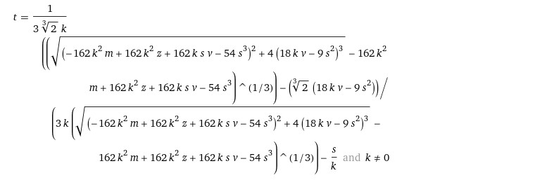 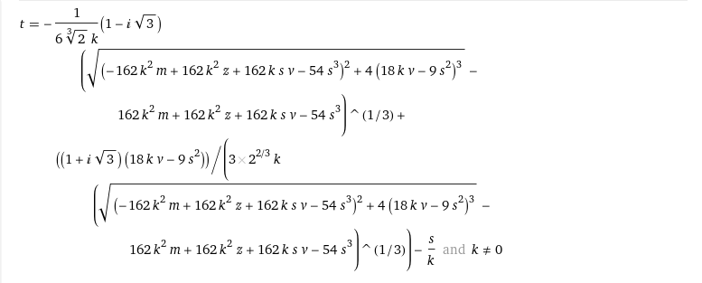 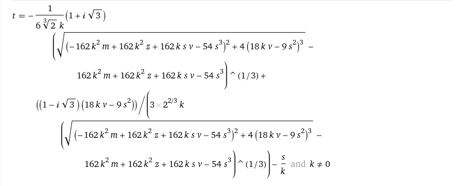 with $\kappa_1=m$, $\kappa_2=v$, $\kappa_3=s$, $\kappa_4=k$
- from WolframAlpha: $t=\frac{1}{3\sqrt[3]{2}\kappa_4}\left[\left(\sqrt{(-162\kappa_4^2\kappa_1 + 162\kappa_4^2 x + 162\kappa_4\kappa_3\kappa_2 - 54\kappa_3^3)^2 + 4(18\kappa_4\kappa_2 - 9\kappa_3^2)^3} - 162\kappa_4^2\kappa_1 + 162\kappa_4^2 x + 162\kappa_4\kappa_3\kappa_2 - 54\kappa_3^3\right)^{1/3}\right] - \frac{\sqrt[3]{2}(18\kappa_4\kappa_2 - 9\kappa_3^2)}{3\kappa_4\left(\sqrt{(-162\kappa_4^2\kappa_1 + 162\kappa_4^2 x + 162\kappa_4\kappa_3\kappa_2 - 54\kappa_3^3)^2 + 4(18\kappa_4\kappa_2 - 9\kappa_3^2)^3} - 162\kappa_4^2\kappa_1 + 162\kappa_4^2 x + 162\kappa_4\kappa_3\kappa_2 - 54\kappa_3^3\right)^{1/3}} - \frac{\kappa_3}{\kappa_4}$

Derivation of solutions for $\kappa_4=0$:
$$\begin{align}
z &= \kappa_1 + \kappa_2t \\
t &= \frac{z-\kappa_1}{\kappa_2}
\end{align}$$
$$\begin{align}
z &= \kappa_1 + \kappa_2t + \frac{\kappa_3t^2}{2} \\
\frac{2z}{\kappa_3} &= \frac{2\kappa_1}{\kappa_3} + \frac{2\kappa_2t}{\kappa_3} + t^2 \\
\frac{2z}{\kappa_3} - \frac{2\kappa_1}{\kappa_3} &= \frac{2\kappa_2t}{\kappa_3} + t^2 \\
\frac{2z}{\kappa_3} - \frac{2\kappa_1}{\kappa_3} + \frac{\kappa_2^2}{\kappa_3^2} &= \frac{2\kappa_2t}{\kappa_3} + t^2 + \frac{\kappa_2^2}{\kappa_3^2} \\
\frac{2z}{\kappa_3} - \frac{2\kappa_1}{\kappa_3} + \frac{\kappa_2^2}{\kappa_3^2} &= \left(t+\frac{\kappa_2}{\kappa_3}\right)^2 \\
\pm\sqrt{\frac{2z}{\kappa_3} - \frac{2\kappa_1}{\kappa_3} + \frac{\kappa_2^2}{\kappa_3^2}} &= t+\frac{\kappa_2}{\kappa_3} \\
t &= \pm\sqrt{\frac{2z\kappa_3}{\kappa_3^2} - \frac{2\kappa_1\kappa_3}{\kappa_3^2} + \frac{\kappa_2^2}{\kappa_3^2}} - \frac{\kappa_2}{\kappa_3} \\
t &= \frac{\pm\sqrt{-2\kappa_1\kappa_3 + 2\kappa_3 z + \kappa_2^2} - \kappa_2}{\kappa_3}
\end{align}$$

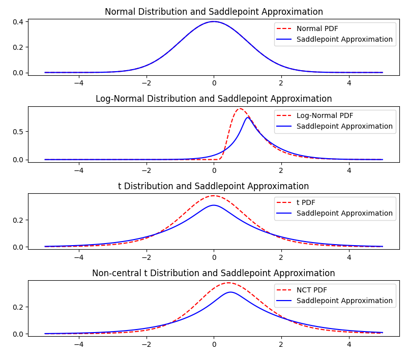
- fit is quite good for t distributions, but not for lognormal
- seems to be always positive

## TODO:
- find $s$ and $k$ for CF Expansion when $s^*$ and $k^*$ are given with computed moments, if not analytically do it numerically
- fix CF Expansion