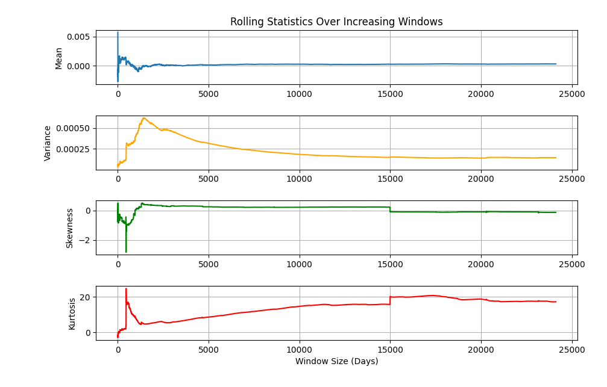

# Experiments with historic data

Data comes from the S&P500 via Yahoo Finance as OHLC from 1928-01-03 to 2023-12-29 (24114 days). Return is the percentage change on close price.

## How do mean, variance, skewness and kurtosis change over time?
- often seen in papers: mean and variance go down, skewness and kurtosis go up in long term

- this seems to be correct, at least for kurtosis it is easily seen

## Are short term moments a good indicator for long term moments?
- papers by Neuberger say no

|moment|short term (daily returns)|long term (yearly returns)|
|---|---|---|
|mean|0.0003|0.0775|
|variance|0.0001|0.0358|
|skewness|-0.1198|-0.4791|
|excess kurtosis|17.2200|0.1135|

- short term moments are not a good indicator for long term moments