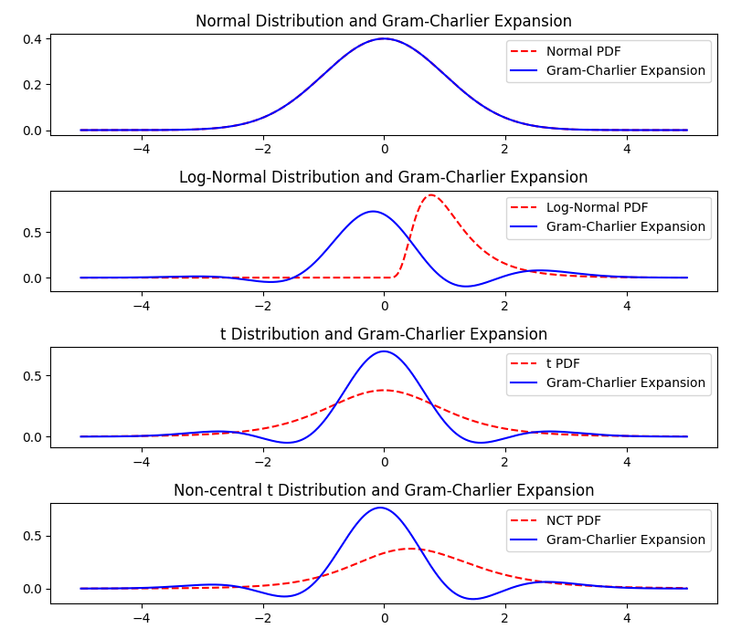
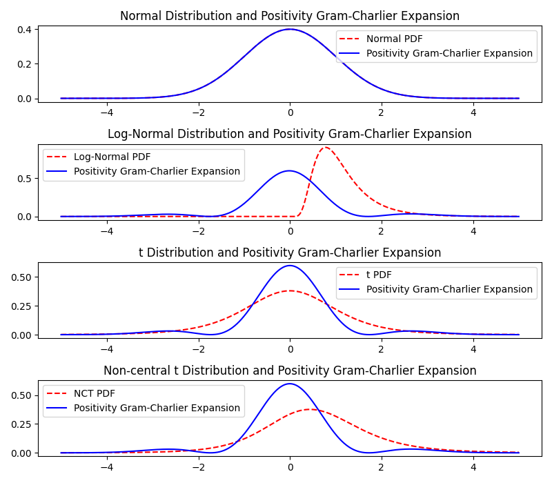
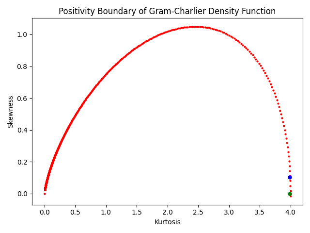
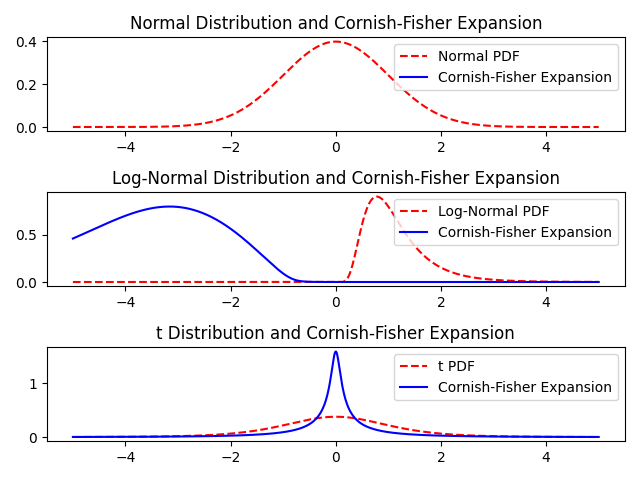

# Expansion Method Tests
How good does the Gram-Charlier, GC with positivity constraints and Cornish-Fisher Expansion work for known distributions with known skewness and kurtosis?

Three distributions:
- standard normal
    - skewness 0
    - excess kurtosis 0
- lognormal, parameter: $\sigma^2$
    - skewness $(\exp(\sigma^2)+2)\cdot \sqrt{\exp(\sigma^2)-1}$
    - excess kurtosis $1\cdot\exp(4\sigma^2)+2\exp(3\sigma^2)+3\exp(2\sigma^2)-6$
- student's t, parameter: $\nu$
    - skewness 0 for $\nu>3$
    - excess kurtosis $\frac{6}{\nu-4}$ for $\nu>4$
- non-central t, paramter: $\nu, \mu$
    - skewness $\frac{\mu\sqrt{\nu}\Gamma\left(\frac{\nu-1}{2}\right)\left(\frac{\nu(\mu^2+2\nu-3)}{(\nu-3)(\nu-2)}-2\left(\frac{(\mu^2+1)\nu}{\nu-2} - \frac{\mu^2\nu\Gamma\left(\frac{\nu-1}{2}\right)^2}{2\Gamma\left(\frac{\nu}{2}\right)^2}\right)\right)}{\sqrt{2}\Gamma\left(\frac{\nu}{2}\right)\left(\frac{(\mu^2+1)\nu}{\nu-2} -\frac{\mu^2\nu\Gamma\left(\frac{\nu-1}{2}\right)^2}{2\Gamma\left(\frac{\nu}{2}\right)^2}\right)^{3/2}}$ for $\nu>3$
    - excess kurtosis $\frac{\frac{(\mu^4+6\mu^2+3)\nu^2}{(\nu-4)(\nu-2)} - \frac{\mu^2\nu}{2\Gamma\left(\frac{\nu}{2}\right)^2}\Gamma\left(\frac{\nu-1}{2}\right)^2\left(\frac{\nu(\mu^2(\nu+1)+3(3\nu-5))}{(\nu-3)(\nu-2)} - 3\left(\frac{(\mu^2+1)\nu}{\nu-2} - \frac{\mu^2\nu\Gamma\left(\frac{\nu-1}{2}\right)^2}{2\Gamma\left(\frac{\nu}{2}\right)^2}\right)\right)}{\left(\frac{(\mu^2+1)\nu}{\nu-2} - \frac{\mu^2\nu\Gamma\left(\frac{\nu-1}{2}\right)^2}{2\Gamma\left(\frac{\nu}{2}\right)^2}\right)^2}-3$ for $\nu>4$

Set parameters to $\sigma=0.5$, $\nu=5$ and $\mu=0.5$, yields (skewness, excess kurtosis):
- normal distribution 0 0
- lognormal: 1.7501896550697178 5.898445673784778
- t: 0 6
- nct: 0.6751189806173602 7.218914650141592

## Gram-Charlier Expansion

- fit is not good
- gram-charlie expansion gets negative, not a density

## Gram-Charlier Expansion with Positivity Constraints

Transforms skewness and kurtosis to
- lognormal: 0.10234746774707859 3.989055204819389
- t: 0.0 3.9901095073734614
- nct: 0.024892965655198204 3.9970717567756724

- fit is not good, but better
- alt least no negativity

## Cornish-Fisher Expansion

- fit is not good
- for lognormal, main mass of pdf is on wrong side