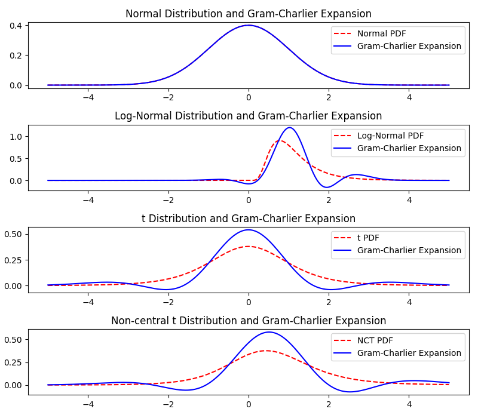
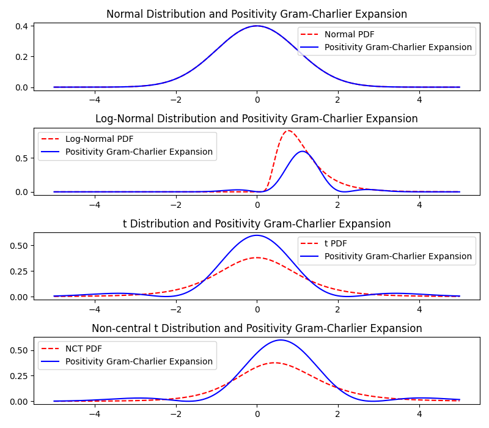

# Expansion Method Tests
How good does the Gram-Charlier, GC with positivity constraints, Cornish-Fisher Expansion, Edgeworth Expansion and Saddlepoint Approximation work for known distributions with known skewness and kurtosis?

Three distributions:
- standard normal
    - skewness 0
    - excess kurtosis 0
- lognormal, parameter: $\sigma^2$
    - skewness $(\exp(\sigma^2)+2)\cdot \sqrt{\exp(\sigma^2)-1}$
    - excess kurtosis $1\cdot\exp(4\sigma^2)+2\exp(3\sigma^2)+3\exp(2\sigma^2)-6$
- student's t, parameter: $\nu$
    - skewness 0 for $\nu>3$
    - excess kurtosis $\frac{6}{\nu-4}$ for $\nu>4$
- non-central t, paramter: $\nu, \mu$
    - skewness $\frac{\mu\sqrt{\nu}\Gamma\left(\frac{\nu-1}{2}\right)\left(\frac{\nu(\mu^2+2\nu-3)}{(\nu-3)(\nu-2)}-2\left(\frac{(\mu^2+1)\nu}{\nu-2} - \frac{\mu^2\nu\Gamma\left(\frac{\nu-1}{2}\right)^2}{2\Gamma\left(\frac{\nu}{2}\right)^2}\right)\right)}{\sqrt{2}\Gamma\left(\frac{\nu}{2}\right)\left(\frac{(\mu^2+1)\nu}{\nu-2} -\frac{\mu^2\nu\Gamma\left(\frac{\nu-1}{2}\right)^2}{2\Gamma\left(\frac{\nu}{2}\right)^2}\right)^{3/2}}$ for $\nu>3$
    - excess kurtosis $\frac{\frac{(\mu^4+6\mu^2+3)\nu^2}{(\nu-4)(\nu-2)} - \frac{\mu^2\nu}{2\Gamma\left(\frac{\nu}{2}\right)^2}\Gamma\left(\frac{\nu-1}{2}\right)^2\left(\frac{\nu(\mu^2(\nu+1)+3(3\nu-5))}{(\nu-3)(\nu-2)} - 3\left(\frac{(\mu^2+1)\nu}{\nu-2} - \frac{\mu^2\nu\Gamma\left(\frac{\nu-1}{2}\right)^2}{2\Gamma\left(\frac{\nu}{2}\right)^2}\right)\right)}{\left(\frac{(\mu^2+1)\nu}{\nu-2} - \frac{\mu^2\nu\Gamma\left(\frac{\nu-1}{2}\right)^2}{2\Gamma\left(\frac{\nu}{2}\right)^2}\right)^2}-3$ for $\nu>4$

Set parameters to $\sigma=0.5$, $\nu=5$ and $\mu=0.5$, yields (skewness, excess kurtosis):
- normal distribution 0 0
- lognormal: 1.7501896550697178 5.898445673784778
- t: 0 6
- nct: 0.6751189806173602 7.218914650141592

## Gram-Charlier Expansion

- fit is not good
- gram-charlie expansion gets negative, not a density

Why is the difference at $x=0$ so big?
- pdf of t distribution mit $\nu$ degress of freedom: $f(x) = \frac{\Gamma\left(\frac{\nu+1}{2}\right)}{\sqrt{\nu\pi}\Gamma\left(\frac{\nu}{2}\right)}\left(1+\frac{x^2}{\nu}\right)^{-\frac{\nu+1}{2}}$
- with $x=0$ and $\nu=5$ we get $f(0)=0.3796$
- t distribution with this parameters has the following moments:
    - mean: 0
    - variance: 5/3
    - skewness: 0
    - excess kurtosis: 6
- GC expansion with $z=\frac{x-\mu}{\sigma}$ and $f(z) = \phi(z)\left[1+\frac{s}{6}He_3(z) + \frac{k}{24}He_4(z)\right]$
- $z = \sqrt{\frac{3}{5}}x = 0$ and $He_4(z)=z^4-6z^2+3$ gives $f(0)=0.3989\left[1+\frac{6}{24}\cdot 3\right] = 0.3989\cdot 1.75 = 0.6981$
- if we increase $x$ by a small amount, $z$ will be increased less (since $\sqrt{\frac{3}{5}}=0.7746$), higher powers of $z$ (like $z^4$, $z^3$) will be smaller than lower powers of $z$ (like $z^2$, $z$) and lower powers of $z$ have negative coefficients in Hermite-Polynomials ($He_3(z) = z^3-3z$, $He_4(z)=z^4-6z^2+3$) which will counteract the $+3$ in $He_4$ and $+1$ in factor after $\phi(z)$, especially for high kurtosis.
- adding more terms to the expansion will not help, 5th moment will be 0 for any t distribution with more than 5 degrees of freedom, for 5 df, the 5th and higher moments are not defined

## Gram-Charlier Expansion with Positivity Constraints

Transforms skewness and kurtosis to
- lognormal: 0.10234746774707859 3.989055204819389
- t: 0.0 3.9901095073734614
- nct: 0.024892965655198204 3.9970717567756724

- fit is not good, but better
- alt least no negativity

How to find this boundary?
- Solve $1 + \frac{s}{6}He_3(z) + \frac{k}{24}He_4(z)=0$ for $s$ and $k$
$$\begin{align}
1 + \frac{s}{6}He_3(z) + \frac{k}{24}He_4(z)&=0 \\
\frac{s}{6}He_3(z) &= -1 - \frac{k}{24}He_4(z) \\
s\cdot He_3(z) &= -6 - \frac{k}{4}He_4(z) \\
s &= -\frac{6}{He_3(z)} - \frac{He_4(z)}{4\cdot He_3(z)}k \\
s &= \frac{z^4-6z^2+3}{12z-4z^3}\cdot k + \frac{24}{12z-4z^3}
\end{align}$$
This works as long as $z\neq\pm\sqrt{3}$

(actually we don't need the following)
$$\begin{align}
1 + \frac{s}{6}He_3(z) + \frac{k}{24}He_4(z)&=0 \\
\frac{k}{24}He_4(z) &= -1 - \frac{s}{6}He_3(z) \\
k\cdot He_4(z) &= -24 - 4s\cdot He_3(z) \\
k &= -\frac{24}{He_4(z)} - \frac{4\cdot He_3(z)}{He_4(z)}s \\
k &= \frac{12z-4z^3}{z^4-6z^2+3}s -\frac{24}{z^4-6z^2+3}
\end{align}$$
- These lines have the form $s = a(z)\cdot k + b(z)$. For two $z$, $z_1$ and $z_2$, we get two lines $s = a(z_1)\cdot k + b(z_1)$ and $s = a(z_2)\cdot k + b(z_2)$. The intersection of this lines is one point of the boundary. 
- Two lines $f(x) = a+bx$ and $g(x) = cx+d$ intersect at $x = \frac{d-b}{a-c}$ and $y = \frac{ad-bc}{a-c}$
- Iterating from $z_1=-10$ to $z_{1000}=-\sqrt{3}$ for 1000 steps (stepsize $\Delta z$), calculating $a(z_i)$, $b(z_i)$, $a(z_i+\Delta z)$ and $b(z_i+\Delta z)$, find intersection gives a point $(k_i,s_i)$ of the boundary
- for completeness adding to more points $(4,0)$ and $(0,0)$

## Cornish-Fisher Expansion

- fit is not good
- for lognormal, main mass of pdf is on wrong side

## Edgeworth Expansion

- fit is not good
- fit seems to be pretty similar to GC expansion, but worse for  log-normal distribution
- gets negative, not a density

## Saddlepoint Approximation

Approximation of cumulant generating function $K$:
$$K(t) \approx \kappa_1t + \frac{\kappa_2t^2}{2} + \frac{\kappa_3t^3}{6} + \frac{\kappa_4t^4}{24}$$
Derivatives:
$$\begin{align}
K'(t) &= \kappa_1 + \kappa_2t + \frac{\kappa_3t^2}{2} + \frac{\kappa_4t^3}{6} \\
K''(t) &= \kappa_2 + \kappa_3t + \frac{\kappa_4t^2}{2}
\end{align}$$
Solving $K'(t)=z$ for $t$ gives saddlepoint $t$:
- if $\kappa_4=0$, $\kappa_3=0$, $\kappa_2=0$ and $\kappa_1\neq 0$: no solution exists
- if $\kappa_4=0$, $\kappa_3=0$ and $\kappa_2\neq 0$: $t = \frac{z-\kappa_1}{\kappa_2}$
- if $\kappa_4=0$ and $\kappa_3\neq 0$: $t = \frac{\pm\sqrt{-2\kappa_1\kappa_3 + 2\kappa_3 z + \kappa_2^2} - \kappa_2}{\kappa_3}$ *can this ever happen? i havn't found a distribution with excess kurtosis $=0$ and skewness $\neq 0$*
- if $\kappa_4\neq 0$ then 3 solutions exist, 2 of them are complex, 1 is real:  with $\kappa_1=m$, $\kappa_2=v$, $\kappa_3=s$, $\kappa_4=k$
- from WolframAlpha: $t=\frac{1}{3\sqrt[3]{2}\kappa_4}\left[\left(\sqrt{(-162\kappa_4^2\kappa_1 + 162\kappa_4^2 x + 162\kappa_4\kappa_3\kappa_2 - 54\kappa_3^3)^2 + 4(18\kappa_4\kappa_2 - 9\kappa_3^2)^3} - 162\kappa_4^2\kappa_1 + 162\kappa_4^2 x + 162\kappa_4\kappa_3\kappa_2 - 54\kappa_3^3\right)^{1/3}\right] - \frac{\sqrt[3]{2}(18\kappa_4\kappa_2 - 9\kappa_3^2)}{3\kappa_4\left(\sqrt{(-162\kappa_4^2\kappa_1 + 162\kappa_4^2 x + 162\kappa_4\kappa_3\kappa_2 - 54\kappa_3^3)^2 + 4(18\kappa_4\kappa_2 - 9\kappa_3^2)^3} - 162\kappa_4^2\kappa_1 + 162\kappa_4^2 x + 162\kappa_4\kappa_3\kappa_2 - 54\kappa_3^3\right)^{1/3}} - \frac{\kappa_3}{\kappa_4}$

- fit is quite good for t distributions, but not for lognormal
- seems to be always positive