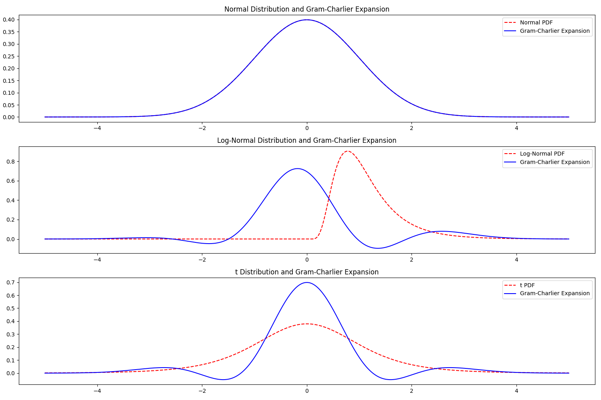

# Simple Expansion
How good does the Gram-Charlier Expansion work for known distributions with known skewness and kurtosis?

Three distributions:
- standard normal
    - skewness 0
    - excess kurtosis 0
- lognormal, parameter: $\sigma^2$
    - skewness $(\exp(\sigma^2)+2)\cdot \sqrt{\exp(\sigma^2)-1}$
    - excess kurtosis $1\cdot\exp(4\sigma^2)+2\exp(3\sigma^2)+3\exp(2\sigma^2)-6$
- student's t, parameter: $\nu$
    - 0 for $\nu>3$
    - $\frac{6}{\nu-4}$ for $\nu>4$

Set parameters to $\sigma=0.5$ and $\nu=5$, yields
- normal distribution 0 0
- lognormal: 1.7501896550697178 5.898445673784778
- t: 0 6

- fit is not good
- gram-charlie expansion gets negative, not a density